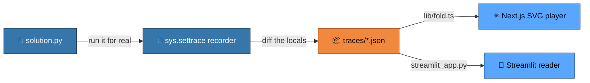
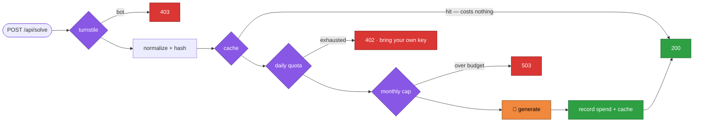

<div align="center">

# ◆ LeetViz

### Watch 150 LeetCode problems actually run — one line at a time.

[](https://leetviz-traces.streamlit.app)


</div>

No signup, no key: **https://leetviz-traces.streamlit.app**

## What it's for

Reading a solution is not the same as seeing it run. The usual way to study these
problems is to read the final code and take someone's word for what the variables
are doing; the loop that "moves a pointer inward" is a sentence, and the sentence
is where it stops making sense.

So every problem here is *executed* ahead of time and every line's effect is
recorded. Press play and the current line lights up while the real state moves
beside it — the array, the two pointers closing in, the hash map filling, the tree
being walked, the recursion stack growing and unwinding. Nothing is hand-drawn and
nothing is an approximation: each frame is the actual value the variables held at
that line.

It is for the stretch where you already know *what* the answer is and still cannot
see *why* it works — and for spotting the pattern under it, which is the part that
transfers to the problem you get asked in the interview.

## Using it

The corpus is the NeetCode 150 shape: **150 problems** across **18 patterns**
(28 Easy, 101 Medium, 21 Hard), all traced and playable.

**Find a problem.** The roadmap lists every problem grouped by pattern, with a
progress bar per group. Search by name, number or pattern — "two sum", "leetcode
25", "sliding window" all work — or filter to Easy / Medium / Hard. Problems you
have watched get ticked, so a long sitting has a visible edge.

Those ticks ride in the page URL as a short token, so a refresh, a bookmark or a
restored tab keeps them, and pasting the link on your phone carries your progress
across. Streamlit cannot set a cookie — `st.context.cookies` is read-only — so the
alternative was a third-party JS component or keying progress off the IP, and an
IP puts everyone behind one office router on the same progress bar. The honest
ceiling: a cold visit to the bare domain starts empty.

**Watch it run.** Open one and you get the problem in original wording, a link out
to LeetCode and NeetCode for the official statement, then the player:

- **Approach tabs** — 148 of the 150 carry two, a brute force next to the
  idiomatic one, with time and space on each. The point is to watch the slow one
  be slow, so the fast one is an answer to something rather than a trick.
- **Variant tabs** — three runs of the same code: `typical`, `edge` and
  `worst-case`. Same algorithm, different input, and the edge case is usually
  where the understanding actually happens.
- **The player** — step forward and back, jump to either end, or press play and
  let it run. The source panel lights the current line; the panel beside it draws
  the live state, shaped to what the value is (cells with indices, grids, trees,
  linked lists, graphs, heaps, tries, interval bars, the recursion call tree).
- **The narration** — one line under the player saying what the step just did, so
  you are never guessing which change mattered.

**Learn the pattern.** Under the trace is the house template for its pattern — the
signal in a problem that points to it, and the shape of the solution it implies.
That comes from the `leetcode-teacher` skill in `.agents/skills/`, read off disk,
so it is the same lesson every time rather than a fresh guess. 12 of the 18
patterns have one so far, covering 108 of the 150 problems; the rest show the
trace alone.

**Ask about it.** The **Ask** view takes a question in words. Naming any of the
150 plays that trace right there and needs no model at all. With a key configured
it also answers free-form questions, and can generate a brand-new trace for a
problem outside the 150 — see [The Ask view](#the-ask-view-optional--needs-a-model-key).

## 🏗 How it's built

One decision shapes everything else: **Python traces the algorithm ahead of time,
and the browser only replays JSON.** There is no Python in the browser, no
algorithm running on the client, and no layout computed at render time — by the
time a trace reaches a reader, even the x/y of every tree node is already in it.



### 🐍 The tracer — where the data comes from

`tracer/leetviz.py` installs a `sys.settrace` line hook and diffs the frame's
locals between one line and the next, emitting `["set", path, value]` and
`["del", path]` ops. Nobody annotates anything; the trace is a by-product of
running the real solution.

Two things there are easy to get wrong, and both are load-bearing:

- **Ops attach to the *previous* line.** A line event fires *before* that line
  runs, so the recorder holds the pending line and emits its diff once the next
  event arrives.
- **Every function in the file is followed**, not just the entry point. Problems
  whose real work lives in a `_dfs` helper would otherwise trace as a three-step
  wrapper — silently shallow, and still passing every check. All functions that
  actually ran are laid into one source listing and step line numbers are remapped
  into it.

Two reserved keys carry structure a flat diff cannot express: `$nodes` for the
object graph (edges are `{"$ref": id}`) and `$calls` for the recursion call tree.
Pointer redirection is then just a `set` on a `$nodes` path — linked lists, trees,
graphs, heaps, tries and call trees all fell out of that without a single new op
type.

Coordinates are baked in Python: trees get x = in-order slot and y = depth at
construction, graphs get a circle layout. **No d3, no networkx** — and nothing for
the client to compute.

Budgets are enforced at build time: `MAX_STEPS = 4000`, and 150 KB **gzipped** per
trace file.

### 📦 The trace format — one schema, verified twice

`lib/schema.ts` is a frozen `schemaVersion: 1` zod schema, and `lib/traces.ts`
parses on read — which quietly makes `next build` the verification step. A bad
trace fails the build instead of the page.

`lib/fold.ts` `stateAt()` replays ops from step 0 on every seek. No inverse ops,
no snapshots: scrubbing backwards is the exact same code path as forwards. A few
thousand ops per seek is faster than the complexity it would take to avoid them.

### 🎨 The renderers — 13 kinds, 4 components

| component | draws |
| --- | --- |
| `Diagram.tsx` | one SVG for everything node-shaped, via `fromNodes` / `fromCalls` / `fromGraph` / `fromHeap` / `fromTrie` adapters |
| `Flat.tsx` | cells, grids, intervals, maps, scalars |
| `Stage.tsx` | dispatch — parses the `viz` spec and picks the renderer |
| `Viewer.tsx` | tabs, source panel, the player |

A variable renders by its value type unless the solution's `viz` spec overrides
it. A spec entry is either a bare kind (`grid`, `heap`, `trie`, `graph`,
`recursion`…) or `role:host`, which attaches one variable to another —
`pointer:nums`, `cells:grid`, `marked:adj`. That is the whole configuration
language.

### 🔒 `/solve` — the gate chain

The site can also generate a trace for a problem outside the 150. Server code is
Python in `api/` (Vercel's runtime convention). Because it spends real money, the
order of the gates *is* the design: nothing expensive may run until every cheap
rejection has had its turn.



`solve()` appends every gate it *enters* to an `audit` list, and the test suite
asserts on that list — so reordering the gates fails the tests even when every
status code is unchanged. Two invariants that would otherwise break silently: a
cache hit must never touch quota or spend, and a bring-your-own key must never
reach KV, a log line, or an error body.

### 🤖 The generator — no generated code is ever executed

`api/_gen.py` has the model emit **the trace itself**, not a program. So there is
no sandbox, because there is nothing to sandbox — validation replays ops as data.

- **The API schema is derived, never written.** `pipeline/schema-json.mts` walks
  the zod tree in `lib/schema.ts` and emits `prompts/solve-schema.json`; the build
  fails if the committed artifact is stale. Two hand-maintained schemas would
  drift, and a drifted schema generates traces the player cannot parse.
- **Failure means *semantic* failure.** Strict structured output makes malformed
  JSON structurally impossible, so there is no parse-and-retry anywhere. What
  `validate()` catches instead: out-of-range line indices, op paths whose parent
  does not exist yet, a last step that is not a `return`, and a returned value
  that disagrees with the declared result.
- **A failing trace escalates to a repair model at most twice**, then 502s. A
  trace that will not replay is refused rather than shown.
- **Failover:** OpenAI first, then NVIDIA NIM, which speaks the same protocol. It
  fires on 429, 5xx and a reply cut off at the output cap — but never on a trace
  that will not replay, because a weaker model is not the fix and it doubles the
  bill.
- **Prompt order is a cost decision.** Static system prompt → static context →
  the user's problem last, so OpenAI's automatic prompt cache actually hits. A
  request id in front of those blocks would change the prefix every call; a test
  asserts the static prefix is byte-identical across two different problems.

### 🗂 Repo map

| path | what lives there | lines |
| --- | --- | --- |
| `content/problems/` | the 150 solutions — the only hand-written source of truth | — |
| `tracer/` | `sys.settrace` recorder, struct layout, the build | 553 |
| `traces/` | committed build artifacts, 4.5 MB of JSON | — |
| `lib/` | frozen zod schema, the op fold, trace loading | 138 |
| `components/` | the four renderers | 1084 |
| `app/` | Next.js routes — roadmap, problem, share, admin | 252 |
| `api/` | Python serverless: gate chain, generator | 1654 |
| `streamlit_app.py` | the entire second front end, one file | 1240 |
| `pipeline/` | the three test suites, seed, schema emitter | 1357 |

`tracer/` and `api/` import **nothing outside the standard library** — no HTTP
client, no layout engine, no schema library. The web app's runtime dependencies
are `next`, `react`, `react-dom` and `zod`.

### ✅ Testing

There is no test framework — no pytest, no vitest, no fixtures. Three plain
scripts of assertions that exit non-zero:

| command | what it proves |
| --- | --- |
| `pnpm check` | every approach of a problem returns the same result on every variant, so no expected outputs are maintained anywhere; plus a content sweep and a schema-freshness check |
| `pnpm test` | the `/solve` gate order, quota, spend cap, BYO-key redaction, and the generation layer — every check offline |
| `pnpm test` | replays all 150 traces through the Streamlit reader, then drives the real app with `AppTest`, because the app has twice crashed on *when* session state may be written while every function was fine |

See `CLAUDE.md` for the full architecture notes.

## Two front ends, one set of traces

`traces/*.json` are committed build artifacts. Both readers replay the same ops.

| | run | what it is |
| --- | --- | --- |
| Next.js | `pnpm dev` → localhost:3000 | the full site: SVG player, `/solve` generation, `/admin/spend` |
| Streamlit | `streamlit run streamlit_app.py` | a single-file reader over the same traces — no server, no API keys |

The Streamlit app is deliberately smaller: problem picker, approach tabs,
variant tabs, a step slider, the source with the current line lit, and the state
drawn beside it (trees and linked lists, the recursion call tree, graphs, grids,
and index-annotated sequences). It does not carry `/solve` — generation needs the
serverless functions in `api/`, which Streamlit does not run.

```bash
pip install -r requirements.txt
streamlit run streamlit_app.py
python3 pipeline/check_streamlit.py   # replays all 150 traces through the reader
```

## Deploy the Streamlit app

Streamlit Community Cloud builds straight from this repo. No secrets are needed
for the part people come for: all 150 traces, the search and the pattern
templates are read off disk and never touch the network. Secrets only turn on the
Ask view's two model-backed modes, below.

Already deployed at https://leetviz-traces.streamlit.app — it redeploys itself
on every push to `main`. To stand up another copy: https://share.streamlit.io →
**Create app** → this repo → branch `main` → main file `streamlit_app.py`.

The Next.js site deploys separately to Vercel (`npx vercel --prod`), which is
what serves `/solve` and `/admin/spend`.

## The Ask view (optional — needs a model key)

Without secrets the Streamlit app still works: the 150 traces and the lookup box
need no network at all — naming any of the 150 plays it, and the pattern template
below it comes from the `leetcode-teacher` skill in `.agents/skills/`, read off
disk rather than generated. Adding a key turns on the **Ask** view, which has two
modes:

- **Explain** — a plain answer in words, from the cheap model.
- **Trace it** — generates a step-by-step visualization in the same shape as the
  150, using `api/_gen.py`. Same prompt, same schema, same repair ladder as the
  deployed `/solve`: there is one generator in this repo, not two.

Add these under **Manage app → Settings → Secrets** on Streamlit Cloud (locally,
`.streamlit/secrets.toml`, which is gitignored). Any one provider is enough — the
chain tries them in order and fails over on 429, 5xx, and a reply cut off at the
output cap:

```toml
GEMINI_API_KEY = "AIza…"
GEMINI_MODEL_GENERATE = "gemini-2.5-flash"
GEMINI_MODEL_CHEAP = "gemini-2.5-flash"
SOLVE_PROVIDER_ORDER = "google,openai,nvidia"

# OPENAI_API_KEY = "sk-…"
# OPENAI_MODEL_GENERATE = "gpt-5"
# NVIDIA_API_KEY = "nvapi-…"
# NVIDIA_MODEL_GENERATE = "openai/gpt-oss-20b"
```

Two things to know before you turn it on:

- **It spends your money**, and the URL is public, so it is capped twice. The
  per-session caps are the ones the page shows — `LEETVIZ_MAX_GENERATIONS`
  (default 3) and `LEETVIZ_MAX_ASKS` (default 15). Session state dies on reload,
  so those bound a polite reader and nothing else; the wall is the per-day
  budget, `LEETVIZ_DAY_GENERATIONS` (default 40) and `LEETVIZ_DAY_ASKS`
  (default 300), counted in the same store the deployed API's quota uses.
  Explain is the cheap path, but a cheap call in a loop is still a bill — both
  paths are counted, not just traces. With no KV credentials in the app's secrets
  that day counter is a file in the container's `/tmp`, so a restart resets it;
  add `KV_REST_API_URL` and `KV_REST_API_TOKEN` to make it survive one and share
  a budget with the deployed API.
- **A weak `*_MODEL_GENERATE` will fail.** The trace is validated by replaying it
  the way the player does, and one that does not replay is refused after two
  repair attempts rather than shown. On `gemini-2.5-flash` that happens on
  problems a stronger model handles.
